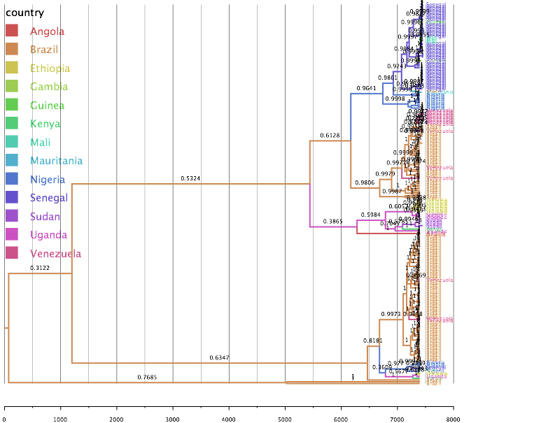
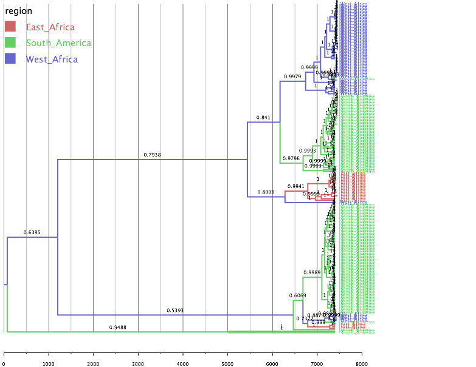
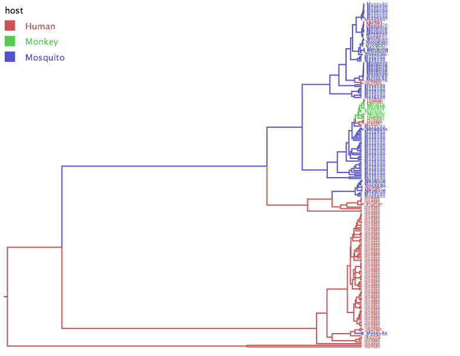

#Phylogenetic and evolutionary relationships among Yellow Fever virus isolates in Africa and South America

####Eden Berga1,2, Sidney Bell1,3, Trevor Bedford1

1Vaccine and Infectious Disease Division, Fred Hutchinson Cancer Research Center, Seattle, WA, USA, 2Mount Rainier High School, Des Moines, WA, USA, 3Molecular and Cellular Biology Graduate Program, University of Washington, Seattle, WA, USA

For more information about Yellow Fever [click here] (https://github.com/ebaberga/yellow-fever/blob/gh-pages/first.md)

##Introduction
During my stay at the Bedfor Lab I have worked on building a Phylogenetic tree for Yellow Fever viruses in Africa and South America. With this project I intend to show the possible differences and similarities of the virus in these regions, and make a phylogeography. 
##Project Questions
1. How similar or Different is yellow fever outbreaks in Africa and South America?
2. What can we tell about the host variation among this regions?

###Targeted regions of my project:
1. East Africa 
2. West Africa
3. South Africa

_The reason I chose these regions is because they have redundant outbreaks of Yellow Fever since its discovery in 1927._
###Steps towards building my phylogenetic tree:
1. Downloaded sequences of Yellow Fever virus from Africa and Brazil. 
2.  Made a python script using Jupyter Notebook that extracts sequences with a host of monkey, human being or mosquito, and sequences with a countries in  Africa and South America (Brazil & Venezuela).
3.  Imported my out put file from the script to Geneious. Then used MAFT in Geneious to do my alignments and RAFT to draw a tree. I used command line to do my aligment the second time. 
4.  Imported my alignment.fasta file from Geneious to Beauti inorder to add traits I wanted to express in my tree,country, host and region, and to convert the extension of the file from .fasta to .xml.
5.  Run Beast to infer evolutionary dynamics from sequence data.
6.  Created an mmc file using tree annotator, and displayed it with Figtree.

##Tree arranged by Country

##Tree arrange by Region

##Tree arrange by Host

####Things I understood from my Phylogenetic trees:
* Most mosquito samples are taken from African counties, while most human samples are from South America(Brazil and Venezuela).
* The virus tends to stay in a one region for a long time.
* The virus jump from one species to another.
* Most of the time the virus goes from mosquitos to humans.

##Figures

* [Host Transition Rates](figures/yf_host_bf.png)
* [Host Transition Network](figures/yf_host_network.png)
* [Region Transition Rate](figures/yf_region_bf.png)
* [Region Transition Network](figures/yf_region_network.png)

Phylogeography of Yellow Fever [VIDEO] (https://www.youtube.com/watch?v=lEQfEna10jc)
